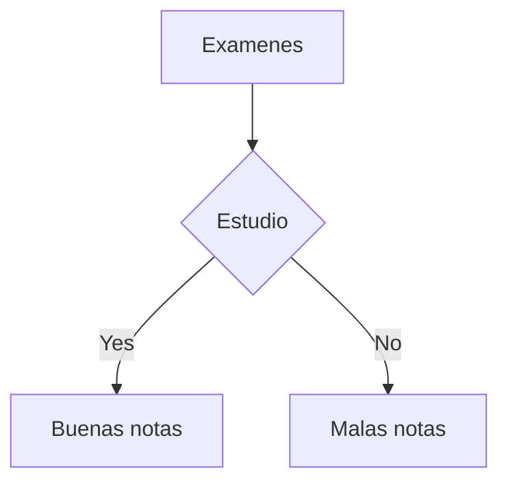

# CV Curriculum

## Datos personales
## Anleú Clara Marvin Rodolfo
## Estado civil: Casado
## Telefono: 40902327
## Residencia: Cobán
## Edad: 18
## Correo: marvin@gmail.com

*Estudiante de Bachillerato Industrial y Perito con Especialidad en Computación, la carrera se destaca por analizar y resolver problemas complejos bajo entornos tecnológicos, así como diseñar e implementar programas y la elaboración de aplicaciones*

**En mi tiempo libre mantengo un estilo de vida activo y equilibrado a través de la práctica de deportes como el balonmano y el fútbol, asimismo disfruto de la lectura, escuchar música,compartir caminatas con amigos y actividades recreativas que estimulan mi bienestar, creatividad y habilidades interpersonales**  


## Comidas  Favoritas

### Guatemaltecas

* Rellenitos
* Chuchitos
* Tamalitos de elote
* Pepián
    * Enchiladas
    * Chiles rellenos
    * Arroz en chocolate

### Rápida

1. Pizza
2. Pasta
3. Pollo 
    1. Hamburguesas 
    2. Tacos
    3. Coca cola 

## Images


## Links

You may be using [Markdown Live Preview](https://www.fifa.com/es/tournaments/mens/worldcup/canadamexicousa2026).

## Cita de Cristiano

> Cristiano Ronaldo es un futbolista profesional portugués, ampliamente considerado uno de los mejores jugadores de todos los tiempos, con una carrera que abarca más de dos décadas desde su debut en 2002, se caracteriza por su extraordinario registro goleador, su dominio físico y una mentalidad competitiva indomable.
>
>> Tiene los récords de máximo goleador histórico de la UEFA Champions League, del Real Madrid y de selecciones nacionales masculinas, habiendo conquistado cinco balones de oro y múltiples títulos continentales tanto a nivel de clubes como de selección.

## Tabla Familiar 

| Cobán  | Escuintla |
| ------------- |:-------------:|
| Maria      | Rosario      |
| Mia      | Orlando    |
| Nicol      | Lucas     |
| Fernando   | Gabriela  |

## Codigo simple 

```
let frase = 'Sigan viendo';
alert(frase);
```

## Diagrama de estudio


## Créditos de autoría

Sitio web elaborado por  `Marvin Rodolfo Anleú Clara`.
